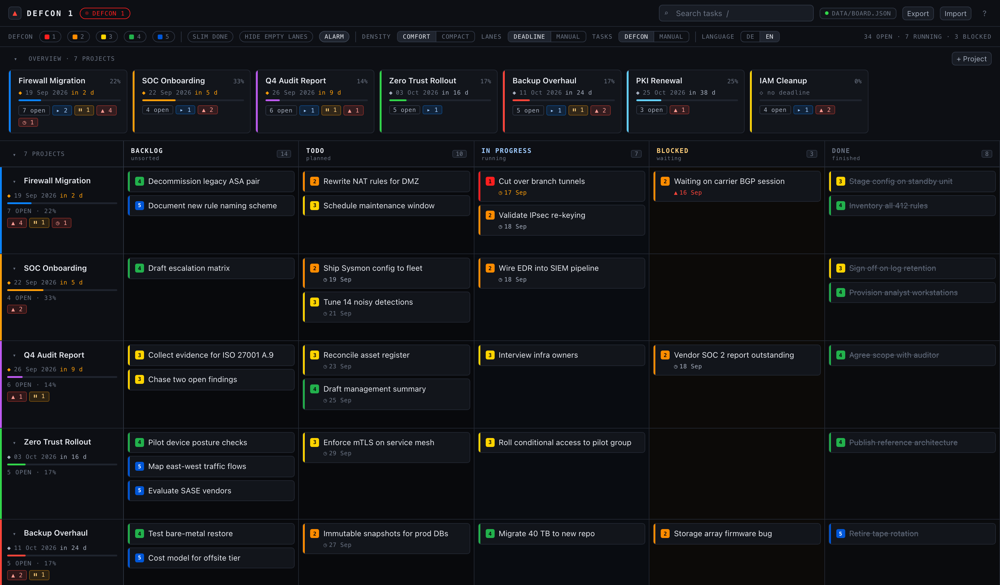
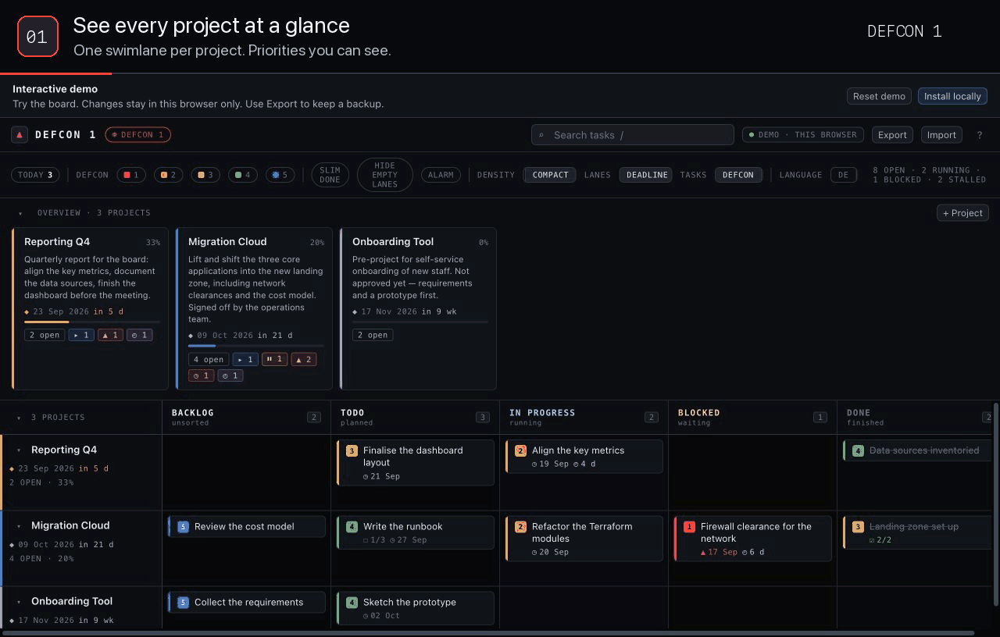
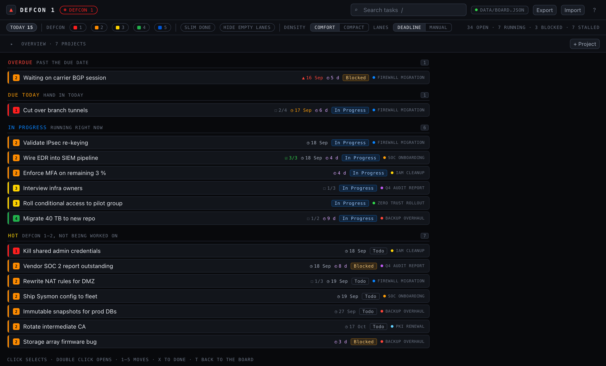
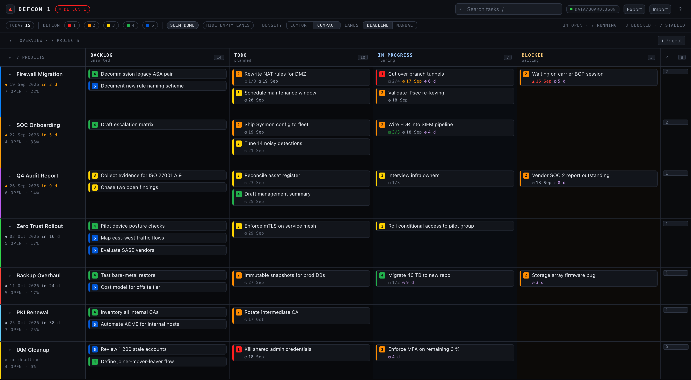

<div align="center">

# ▲ DEFCON 1

**A local, login-free task board for the ten projects you are juggling at once.**

One swimlane per project · five status columns · priorities as DEFCON levels ·
one JSON file on your disk.

**[Try the browser demo](https://andregasser.github.io/defcon1/)** — no installation or account needed.

[](https://react.dev)
[](https://www.typescriptlang.org)
[](https://vite.dev)
[](https://github.com/andregasser/defcon1/actions/workflows/ci.yml)




</div>

---

## Why this exists

Most boards give you one project and expect you to switch tabs for the rest.
DEFCON 1 inverts that: **every project is a row**, always visible, so the answer
to *"what is actually on fire right now?"* is one glance, not five clicks.

And it stays yours. No account, no sync service, no telemetry — a tiny loopback
server, one `board.json`, and any browser you feel like opening.

## Quickstart

<details>
<summary><strong>Watch the board in action — 18 seconds</strong></summary>



Quick-add a task → set its priority → drag it into In Progress → focus a project.
The walkthrough uses real demo screenshots, with captions and highlights.

</details>

Prefer a still image? [View the board screenshot](docs/images/hero.png), or
[try the interactive demo](https://andregasser.github.io/defcon1/).

Want to explore first? The [interactive demo](https://andregasser.github.io/defcon1/)
opens with an example board. You can edit tasks, drag cards, change priorities,
and switch between English and German. Changes stay in that browser's local
storage; they are not sent to an API or shared with other visitors. Sound starts
off and can be enabled with the **Alarm** switch.

**Reset demo** replaces your demo board with fresh examples after confirmation
and clears its search, task filters, focus, and collapsed lanes. **Export** saves
a JSON backup that you can import into a local installation. Browser storage
can be cleared or unavailable, so export anything you want to keep. The local
installation below uses a server and one board file shared by your browsers.

Install [Git](https://git-scm.com/downloads) and
[Node.js 24 LTS](https://nodejs.org/en/download) (the latest 24.x release, including
npm). Node.js 24 is the version used in CI. Then run:

```bash
git clone https://github.com/andregasser/defcon1.git
cd defcon1
npm ci
npm start          # builds the frontend and starts the server
```

Open **<http://127.0.0.1:7777>** — in Safari, Firefox, Chrome, or all three at
the same time. They all see the same board. Create your first project or load
the example board from the welcome screen to try it out.

Keep the terminal running while you use the board; **Ctrl+C** stops the server.
Your tasks stay on disk and return the next time you run `npm start` in this
directory. By default they live in `data/board.json` inside the checkout; see
[Where your data lives](#where-your-data-lives) for backups and an external data
directory.

## Updating

Finish your edits and use **Export** to save a copy of your board before updating.
Then close the board tabs and stop the server with **Ctrl+C**.

From your existing checkout on `main`, with any source changes committed or
stashed, run:

```bash
git pull --ff-only
npm ci
npm start
```

This installs the locked dependencies and rebuilds the frontend. Keep using the
same `DEFCON1_DATA_DIR` setting if you configured one, then reopen the board.
Updating the existing checkout leaves its gitignored `data/` directory intact;
replacing or deleting the checkout does not. If Git reports a conflict or a
diverged branch, resolve it before continuing instead of forcing the update.

## Highlights

### Ten projects, one screen

The **command deck** puts one tile per project above the board: deadline
countdown, progress bar, and counters for open / doing / blocked / hot /
overdue / stalled. Click a tile to focus that project, click several to focus
several, double-click to edit it.

Below it, the board keeps ten lanes readable: sticky column headers, a sticky
lane rail, capped cell height so one overloaded project cannot push the others
off screen, and collapsible lanes that leave a summary line behind.

### Idle time, because DEFCON only tells you half the story

Every card remembers when it entered its current column. Sit still too long — **3
days** in In Progress, **2** in Blocked — and it picks up a violet `◴ 6 d`, while
the lane, the tile, and the header start counting the ones that stopped moving.

DEFCON says what is important; idle time says what got forgotten. Reordering
inside a column or moving a card to another project does **not** restart the
clock — only a real column change does.

### A checklist inside a task

Add as many steps as you like in the task dialog: tick them off, rename them,
delete them. The card shows only the tally — `☐ 1/3`, turning green at `☑ 3/3`.

A step is deliberately *not* a task: no status, no DEFCON, no place on the board.
Otherwise the lanes would be unreadable within a week.

### Today (<kbd>t</kbd>)

One flat list across every project, grouped by pressure instead of by project:
**Overdue**, **Due today**, **In progress**, **Hot** (DEFCON 1–2 and not yet
being worked on).

Each task appears in exactly one group — the sharpest one wins — so the numbers
actually mean something. The list ignores search and the DEFCON filter, since it
has its own opinion about what is urgent, but it does respect the project focus.
Selection and the usual keys (<kbd>1</kbd>–<kbd>5</kbd>, <kbd>e</kbd>,
<kbd>x</kbd>, <kbd>Backspace</kbd>) work exactly as on the board.

<div align="center">

</div>

### A density switch that actually earns its keep

Press <kbd>d</kbd> for compact mode, and narrow the Done column to just its
count — the working columns get the width instead.

<div align="center">

</div>

### Priorities as DEFCON levels

Because "high / medium / low" never survives contact with ten projects.

| Level | Colour | Code word | Meaning |
| :---: | --- | --- | --- |
| **1** | 🟥 red | `COCKED PISTOL` | now |
| **2** | 🟧 orange | `FAST PACE` | critical |
| **3** | 🟨 yellow | `ROUND HOUSE` | important |
| **4** | 🟩 green | `DOUBLE TAKE` | normal |
| **5** | 🟦 blue | `FADE OUT` | someday |

These are the official signal colours of the scale, used verbatim rather than
toned down to fit the UI — that contrast *is* the feature.

Every card carries a coloured stripe on its left edge. Levels 1 and 2 count as
**hot** and light up both the lane header and the command deck.

Urgency needs no housekeeping: with task sorting on `DEFCON`, a task that gets
promoted rises to the top of its cell by itself. Switch to `MANUAL` if you would
rather order cards by hand. A fresh DEFCON 1 may also make a noise — one click on
the `ALARM` chip silences it for good on that device.

### Keyboard-first

| Key | Action |
| --- | --- |
| <kbd>Tab</kbd> / <kbd>Shift</kbd> + <kbd>Tab</kbd> | focus and select a card |
| <kbd>Enter</kbd> | open the focused card |
| <kbd>Space</kbd>, arrow keys, <kbd>Space</kbd> | pick up, move and drop a card; <kbd>Escape</kbd> cancels |
| <kbd>1</kbd>–<kbd>5</kbd> | move the selected task to Backlog / Todo / In Progress / Blocked / Done |
| <kbd>Shift</kbd> + <kbd>1</kbd>–<kbd>5</kbd> | set its DEFCON level |
| <kbd>t</kbd> | toggle the Today list across all projects |
| <kbd>n</kbd> | new task in the first visible project |
| <kbd>p</kbd> | new project |
| <kbd>e</kbd> | open the selected task |
| <kbd>x</kbd> | toggle the selected task Done ⇄ Todo |
| <kbd>Backspace</kbd> / <kbd>Delete</kbd> | delete the selected task (with a confirmation) |
| <kbd>/</kbd> | jump to search |
| <kbd>c</kbd> | collapse / expand all lanes |
| <kbd>d</kbd> | toggle density |
| <kbd>?</kbd> | help |
| <kbd>Escape</kbd> | backs out of quick-add → selection → search → filter → focus → Today, in that order |

With the mouse: drag cards between columns, between projects, or to reorder
within a column. Click selects and double-click opens. Empty cells always show
`+ Add task`, so a new project has a visible starting point. On touch devices,
add buttons stay visible in populated cells too.

Tabbing to a card selects it, so task shortcuts act on the focused card.
Shift + number works with symbol-producing keyboard layouts and the numeric
keypad. Dialogs focus the first input, keep keyboard focus inside while open,
and return it to the opening control when that control is still present.

### Small screens

At widths up to 600 px, the project overview starts collapsed independently of
your saved desktop setting. Search and Today stay directly accessible; open
**View & filters** for DEFCON filters, density, sorting, language and other view
options. Active DEFCON filters are counted on that button. Both disclosures
can be opened without changing the desktop overview preference. Scroll the
board sideways to reach the remaining columns; the project rail stays visible.

### Quick-add syntax

Type the whole task in one line:

```
Open firewall ticket !2 @tomorrow
```

* `!1` … `!5` sets the DEFCON level.
* `@today`, `@tomorrow`, `@mon`…`@sun`, `@+3d`, `@+2w`, `@2026-09-20`, `@20.09.`,
  `@20.09.2027` set the due date. German aliases (`@heute`, `@morgen`, `@fr`, …)
  work too.
* Anything that does not parse as a token simply stays in the title — so an
  e-mail address or a stray `!` never gets swallowed.

## Where your data lives

In **`data/board.json`**. Exactly one file on disk — not in the browser. That is
the entire reason the little server exists.

localStorage works everywhere, but it is **siloed per browser**: a board you
create in Safari is invisible to Firefox, and Safari additionally evicts it after
seven days of inactivity on `file://` pages. So the server holds the truth and
every browser talks to it.

* **Conflicts** — every save carries a `rev` counter. Write with a stale
  revision and you get HTTP 409; the board adopts the server state and tells you
  so in the status line.
* **Second browser** — the board polls every 4 seconds, so someone else's
  changes just show up.
* **Crash safety** — writes go through a temp file plus `rename`, so a crash can
  never leave the file half-written. Each write also drops a copy into
  `data/backups/` (the last 20 are kept).
* **No server?** — the frontend falls back to localStorage and says
  *"this browser only"* in the top right. Start the server later and an existing
  localStorage board is migrated over once.
* **By hand** — `Export` writes a JSON file, `Import` reads it back. It is one
  process and one file, so you are free to copy, version, or sync
  `data/board.json` yourself.
* **Somewhere else** — `DEFCON1_DATA_DIR` moves the file out of the checkout
  entirely, which is worth doing; see
  [Keeping your board out of the checkout](#keeping-your-board-out-of-the-checkout).

View settings (density, sort order, collapsed lanes, focus) deliberately stay in
localStorage — how you *look* at the board is per-device; the tasks are not.

## Configuration

| Variable | Default | Purpose |
| --- | --- | --- |
| `DEFCON1_PORT` | `7777` | HTTP port |
| `DEFCON1_HOST` | `127.0.0.1` | bind address |
| `DEFCON1_DATA_DIR` | `data/` inside the checkout | where `board.json` and `backups/` live — an explicitly configured relative path resolves against the server process's **working directory** |

To reach the board from a tablet or a second machine on the same LAN:

```bash
DEFCON1_HOST=0.0.0.0 npm start
```

> [!WARNING]
> There is **no authentication**. Only bind beyond loopback on a network you
> trust.

### Keeping your board out of the checkout

The default `data/` directory lives inside the checkout that contains the server.
Two checkouts therefore mean two boards — and a git worktree you later remove
takes its `data/` along with it: the directory is gitignored, and removing a
worktree deletes ignored files together with everything else.

Point the variable at an absolute path outside every checkout and the board stops
depending on your current directory:

```bash
# ~/.zshrc
export DEFCON1_DATA_DIR="$HOME/.defcon1/data"
```

The directory, the file and `backups/` are created on demand, so moving an
existing board is a plain copy. Turning the in-repo path into a symlink keeps it
working as well — then you land on the same file whether or not the variable is
set:

```bash
mkdir -p "$HOME/.defcon1/data"
cp -R data/. "$HOME/.defcon1/data/"
rm -rf data && ln -s "$HOME/.defcon1/data" data
```

## Development

GitHub Actions runs `npm ci`, `npm test`, `npm run build`, and `npm run build:demo`
(including the TypeScript check) on Ubuntu with Node.js 24 LTS for every pull request and every
push to `main`. The CI badge above shows the result for `main`. The workflow can
also be started manually from the Actions tab.

| Command | Purpose |
| --- | --- |
| `npm start` | build + serve (the normal way) |
| `npm run serve` | serve only, no rebuild |
| `npm run dev` | Vite dev server (`:5173`) + API server, with hot reload |
| `npm test` | Vitest — logic and UI suite |
| `npm run typecheck` | TypeScript strict check |
| `npm run build` | TypeScript check + production build |
| `npm run build:demo` | TypeScript check + browser-only demo in `dist-demo/` |

```
server/server.mjs   dependency-free HTTP server: /api/state + dist/
scripts/dev.mjs     runs Vite and the API server together
src/App.tsx         orchestration, drag & drop, shortcuts
src/components/     Board, Cell, TaskCard, LaneHeader, CommandDeck, TodayView, dialogs
src/hooks/          useBoard (data + sync), usePrefs (view state)
src/lib/            board (pure logic), date, quickAdd, storage, today
src/__tests__/      logic and UI tests
data/board.json     your data (or $DEFCON1_DATA_DIR/board.json)
```

**Stack:** React 19, TypeScript strict, Vite 7, [`@dnd-kit`](https://dndkit.com)
for drag & drop, Vitest. The server runs on the Node standard library alone —
zero runtime dependencies.

**Languages:** the interface ships in English and German. On first load it
follows your browser; the `LANGUAGE` switch in the toolbar overrides that per
device. The five column names and the DEFCON code words stay untranslated on
purpose — they are the shared vocabulary of the board.

### Publishing the browser demo

GitHub Pages serves only the static demo build. In the repository's **Settings →
Pages**, select **GitHub Actions** as the source. The **Deploy browser demo**
workflow tests and builds `main`, then deploys `dist-demo/` after each push. It
can also be run manually on `main`. Pull requests run both builds in CI without
deploying. The workflow takes the base path from Pages, including when deployed
from a fork; update the demo links in this README for your own repository.

To preview locally, run `npm run build:demo` followed by
`npx vite preview --mode demo`, then open the printed URL ending in `/defcon1/`.
This mode never connects to the board server. Its board and view preferences use
separate `defcon1.demo.*` storage keys, and the regular `npm start` build keeps
its existing behavior and data. No server, board file, or backup directory is
included in the Pages artifact.

## Contributing

Bug reports, documentation improvements, and focused pull requests are welcome.
See [CONTRIBUTING.md](CONTRIBUTING.md) for development setup, checks, and the
contribution workflow. [AGENTS.md](AGENTS.md) documents the detailed architecture
and working agreements for humans and coding agents.

## License

The project code and documentation are licensed under the [MIT License](LICENSE).

The bundled alarm recordings in `public/sounds/` are third-party assets and are
**not covered by the MIT License**. They remain subject to the Pixabay Content
License; see [sound sources and licensing notes](public/sounds/README.md).
Third-party dependencies retain their respective licenses.
