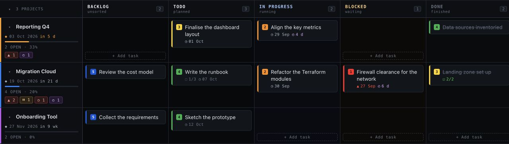
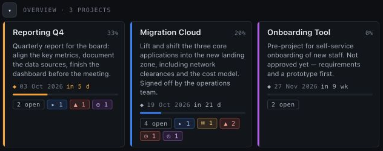
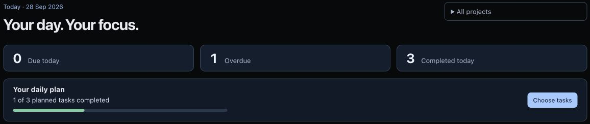
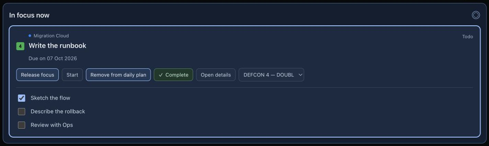
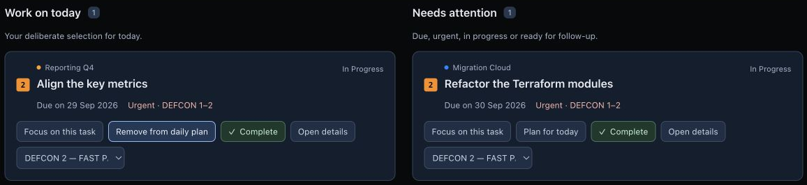
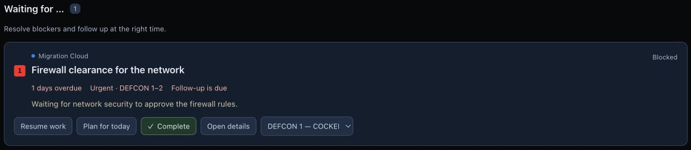
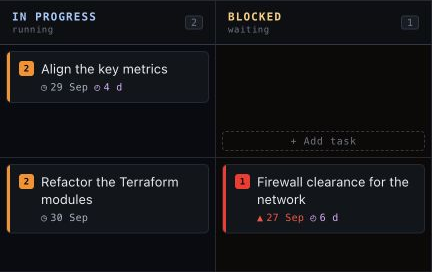
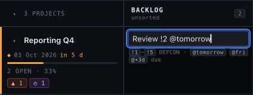
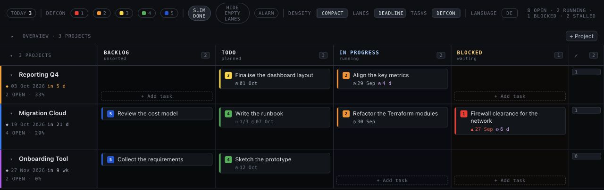
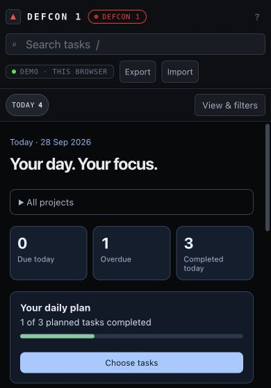

<div align="center">

# ▲ DEFCON 1

**A local, login-free task board for the ten projects you are juggling at once.**

One swimlane per project · five status columns · priorities as DEFCON levels ·
one JSON file on your disk.

**[Try the browser demo](https://andregasser.github.io/defcon1/)** — no installation or account needed.

[](https://react.dev)
[](https://www.typescriptlang.org)
[](https://vite.dev)
[](https://github.com/andregasser/defcon1/actions/workflows/ci.yml)




</div>

[Features](#features) · [Quickstart](#quickstart) · [User guide](docs/usage.md) · [Data and backups](#where-your-data-lives)

---

## Why this exists

Most boards give you one project and expect you to switch tabs for the rest.
DEFCON 1 inverts that: **every project is a row**, always visible, so the answer
to *"what is actually on fire right now?"* is one glance, not five clicks.

And it stays yours. No account, no sync service, no telemetry — a tiny loopback
server, one `board.json`, and any browser you feel like opening.

## Quickstart

Want to explore first? The [interactive demo](https://andregasser.github.io/defcon1/)
opens with an example board. You can edit tasks, drag cards, change priorities,
and switch between English and German. Changes stay in that browser's local
storage; they are not sent to an API or shared with other visitors. Sound starts
off and can be enabled with the **Alarm** switch.

**Reset demo** replaces your demo board with fresh examples after confirmation
and clears its search, task filters, focus, and collapsed lanes. **Export** saves
a JSON backup that you can import into a local installation. Browser storage
can be cleared or unavailable, so export anything you want to keep. The local
installation below uses a server and one board file shared by your browsers.

Install [Git](https://git-scm.com/downloads) and
[Node.js 24 LTS](https://nodejs.org/en/download) (the latest 24.x release, including
npm). Node.js 24 is the version used in CI. Then run:

```bash
git clone https://github.com/andregasser/defcon1.git
cd defcon1
npm ci
npm start          # builds the frontend and starts the server
```

Open **<http://127.0.0.1:7777>** — in Safari, Firefox, Chrome, or all three at
the same time. They all see the same board. Create your first project or load
the example board from the welcome screen to try it out.

Keep the terminal running while you use the board; **Ctrl+C** stops the server.
Your tasks stay on disk and return the next time you run `npm start` in this
directory. By default they live in `data/board.json` inside the checkout; see
[Where your data lives](#where-your-data-lives) for backups and an external data
directory.

## Updating

Finish your edits and use **Export** to save a copy of your board before updating.
Then close the board tabs and stop the server with **Ctrl+C**.

From your existing checkout on `main`, with any source changes committed or
stashed, run:

```bash
git pull --ff-only
npm ci
npm start
```

This installs the locked dependencies and rebuilds the frontend. Keep using the
same `DEFCON1_DATA_DIR` setting if you configured one, then reopen the board.
Updating the existing checkout leaves its gitignored `data/` directory intact;
replacing or deleting the checkout does not. If Git reports a conflict or a
diverged branch, resolve it before continuing instead of forcing the update.

## Features

Each screenshot below focuses on one part of the current app, using example
projects. Click an image to inspect it at full size. The [user guide](docs/usage.md)
covers the detailed rules and shortcuts.

### All your projects on one board

Every project gets a swimlane across the same five status columns. Drag tasks
between columns or projects; sticky headings and independently scrolling cells
keep the board readable as it grows.

The **project overview** adds deadlines, progress and counts of running, blocked,
urgent, overdue and stalled tasks. Click a tile to focus one project, or select
several to work across them.



### A deliberate daily plan

Open **Today** with <kbd>t</kbd>, then **Choose tasks** or **Plan for today** to
build your day across projects. Planning leaves due dates alone; the progress bar
counts completed tasks from your explicit plan. Unfinished plans stay on their
original day until you deliberately plan them again.



### One task in focus, with its checklist

**Focus on this task** brings one task and its steps to the front. Start it, tick
off checklist items or complete it directly; the board card shows a compact
checklist tally. Completing a focused task offers a possible next task for you
to choose.



### Urgent work stays visible

**Needs attention** collects other tasks that are due, overdue, at DEFCON 1–2,
in progress or ready for follow-up. It stays separate from your deliberate plan,
so incoming work does not silently expand it. Today counters filter the list;
**Undo** reverses your last Today task edit in this session.



### Blockers with a next step

Record what a task is **Waiting for** and set an optional follow-up date. Blocked
tasks stay together in Today, with overdue, urgent and follow-up flags visible.
**Resume work** moves a cleared task back into progress.



### Priority and idle time at a glance

DEFCON runs from **1 — now** (red) through **2 — critical** (orange),
**3 — important** (yellow), **4 — normal** (green) to **5 — someday** (blue).
Urgent tasks rise within their column automatically, or you can choose manual
ordering. The optional **Alarm** sounds when a task reaches DEFCON 1.

Violet aging chips flag tasks unchanged for at least **3 days in In Progress**
or **2 days in Blocked**. Priority tells you what matters; aging shows what has
stopped moving.



### Capture a task in one line

Click **+ Add task** or press <kbd>n</kbd>. Type `Review !2 @tomorrow` and press
Enter to create a task with DEFCON 2 and tomorrow's due date. German and English
date tokens work in either interface language; see the
[full quick-add syntax](docs/usage.md#quick-add-syntax).



### Make room for more projects

Switch to **Compact** with <kbd>d</kbd>, collapse the project overview or individual
lanes, and enable **Slim Done** to give working columns more space. Task titles
keep wrapping in both densities.



### Keyboard access and small screens

Use <kbd>Tab</kbd> to select tasks, <kbd>Enter</kbd> to open them,
<kbd>1</kbd>–<kbd>5</kbd> to change status and <kbd>Shift</kbd> + a number to change
DEFCON. Keyboard drag-and-drop and Today row navigation are supported; press
<kbd>?</kbd> for help or read the [shortcut reference](docs/usage.md#keyboard-first).

On a phone, search and Today stay within reach while **View & filters** holds
secondary controls. Today stacks into one column; the board scrolls sideways
with its project rail kept visible.



### Find, filter and keep your work

| Feature | What it does |
| --- | --- |
| Search and filters | Search task titles and notes; Today also searches project names, checklist text and blocker reasons. Combine search with DEFCON filters and project focus. |
| Project details | Keep a description, colour and deadline with each project; sort lanes by deadline or your own order. |
| Task details | Keep notes, due dates, checklists, planning dates and follow-ups with the task. |
| English and German | Switch the complete interface with **Language**; dates follow the selected language. Your own content stays as written. |
| Local ownership | The local server saves one JSON board shared by your browsers, with automatic backups and stale-write protection. |
| Export and import | Download a JSON backup, then import it into another installation or bring work out of the browser demo. |
| Per-device preferences | Density, language, sorting and focus stay on the device; task data travels with your board. |
| Browser fallback | If the server is unavailable, work can stay in browser storage; connection retries recover automatically until you edit locally. |

Read the [user guide](docs/usage.md) for exact planning, focus and undo behavior,
or [data and backups](#where-your-data-lives) for persistence and recovery.

## Where your data lives

In **`data/board.json`**. Exactly one file on disk — not in the browser. That is
the entire reason the little server exists.

localStorage works everywhere, but it is **siloed per browser**: a board you
create in Safari is invisible to Firefox, and Safari additionally evicts it after
seven days of inactivity on `file://` pages. So the server holds the truth and
every browser talks to it.

* **Conflicts** — every save carries a `rev` counter. Write with a stale
  revision and you get HTTP 409; the board adopts the server state and tells you
  so in the status line.
* **Second browser** — the board polls every 4 seconds, so someone else's
  changes just show up.
* **Crash safety** — writes go through a temp file plus `rename`, so a crash can
  never leave the file half-written. Each write also drops a copy into
  `data/backups/` (the last 20 are kept).
* **No server?** — the frontend falls back to localStorage and says
  *"this browser only"* in the top right. Start the server later and an existing
  localStorage board is migrated over once.
* **By hand** — `Export` writes a JSON file, `Import` reads it back. It is one
  process and one file, so you are free to copy, version, or sync
  `data/board.json` yourself.
* **Somewhere else** — `DEFCON1_DATA_DIR` moves the file out of the checkout
  entirely, which is worth doing; see
  [Keeping your board out of the checkout](#keeping-your-board-out-of-the-checkout).

View settings (density, sort order, collapsed lanes, focus) deliberately stay in
localStorage — how you *look* at the board is per-device; the tasks are not.

## Configuration

| Variable | Default | Purpose |
| --- | --- | --- |
| `DEFCON1_PORT` | `7777` | HTTP port |
| `DEFCON1_HOST` | `127.0.0.1` | bind address |
| `DEFCON1_DATA_DIR` | `data/` inside the checkout | where `board.json` and `backups/` live — an explicitly configured relative path resolves against the server process's **working directory** |

To reach the board from a tablet or a second machine on the same LAN:

```bash
DEFCON1_HOST=0.0.0.0 npm start
```

> [!WARNING]
> There is **no authentication**. Only bind beyond loopback on a network you
> trust.

### Keeping your board out of the checkout

The default `data/` directory lives inside the checkout that contains the server.
Two checkouts therefore mean two boards — and a git worktree you later remove
takes its `data/` along with it: the directory is gitignored, and removing a
worktree deletes ignored files together with everything else.

Point the variable at an absolute path outside every checkout and the board stops
depending on your current directory:

```bash
# ~/.zshrc
export DEFCON1_DATA_DIR="$HOME/.defcon1/data"
```

The directory, the file and `backups/` are created on demand, so moving an
existing board is a plain copy. Turning the in-repo path into a symlink keeps it
working as well — then you land on the same file whether or not the variable is
set:

```bash
mkdir -p "$HOME/.defcon1/data"
cp -R data/. "$HOME/.defcon1/data/"
rm -rf data && ln -s "$HOME/.defcon1/data" data
```

## Development

GitHub Actions runs `npm ci`, `npm test`, `npm run build`, and `npm run build:demo`
(including the TypeScript check) on Ubuntu with Node.js 24 LTS for every pull request and every
push to `main`. The CI badge above shows the result for `main`. The workflow can
also be started manually from the Actions tab.

| Command | Purpose |
| --- | --- |
| `npm start` | build + serve (the normal way) |
| `npm run serve` | serve only, no rebuild |
| `npm run dev` | Vite dev server (`:5173`) + API server, with hot reload |
| `npm test` | Vitest — logic and UI suite |
| `npm run typecheck` | TypeScript strict check |
| `npm run build` | TypeScript check + production build |
| `npm run build:demo` | TypeScript check + browser-only demo in `dist-demo/` |

```
server/server.mjs   dependency-free HTTP server: /api/state + dist/
scripts/dev.mjs     runs Vite and the API server together
src/App.tsx         orchestration, drag & drop, shortcuts
src/components/     Board, Cell, TaskCard, LaneHeader, CommandDeck, TodayView, dialogs
src/hooks/          useBoard (data + sync), usePrefs (view state)
src/lib/            board (pure logic), date, quickAdd, storage, today
src/__tests__/      logic and UI tests
data/board.json     your data (or $DEFCON1_DATA_DIR/board.json)
```

**Stack:** React 19, TypeScript strict, Vite 7, [`@dnd-kit`](https://dndkit.com)
for drag & drop, Vitest. The server runs on the Node standard library alone —
zero runtime dependencies.

**Languages:** the interface ships in English and German. On first load it
follows your browser; the `LANGUAGE` switch in the toolbar overrides that per
device. The five column names and the DEFCON code words stay untranslated on
purpose — they are the shared vocabulary of the board.

### Publishing the browser demo

GitHub Pages serves only the static demo build. In the repository's **Settings →
Pages**, select **GitHub Actions** as the source. The **Deploy browser demo**
workflow tests and builds `main`, then deploys `dist-demo/` after each push. It
can also be run manually on `main`. Pull requests run both builds in CI without
deploying. The workflow takes the base path from Pages, including when deployed
from a fork; update the demo links in this README for your own repository.

To preview locally, run `npm run build:demo` followed by
`npx vite preview --mode demo`, then open the printed URL ending in `/defcon1/`.
This mode never connects to the board server. Its board and view preferences use
separate `defcon1.demo.*` storage keys, and the regular `npm start` build keeps
its existing behavior and data. No server, board file, or backup directory is
included in the Pages artifact.

## Contributing

Bug reports, documentation improvements, and focused pull requests are welcome.
See [CONTRIBUTING.md](CONTRIBUTING.md) for development setup, checks, and the
contribution workflow. [AGENTS.md](AGENTS.md) documents the detailed architecture
and working agreements for humans and coding agents.

## License

The project code and documentation are licensed under the [MIT License](LICENSE).

The bundled alarm recordings in `public/sounds/` are third-party assets and are
**not covered by the MIT License**. They remain subject to the Pixabay Content
License; see [sound sources and licensing notes](public/sounds/README.md).
Third-party dependencies retain their respective licenses.
